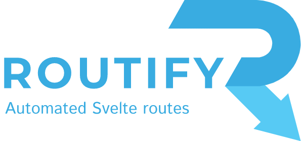

     
    

 

----

# Install

* Install the Router only: `npm install --save-dev @roxi/routify`
* Quickstart: `npm init routify my-project`

# Documentation

[routify.dev](https://routify.dev/guide/introduction)

# Example

[Starter example](https://example.routify.dev/example) Example from the starter template. Refresh a page to see how it is loaded.

# Tutorials

* [Easy client-side SPA routing with Routify](https://www.youtube.com/watch?v=AGLUJlOC6f0) by Jitesh
* [How to add PostSCSS to Routify Starter](https://johanronsse.be/2020/05/01/how-to-add-postcss-to-routify/) by Wolfr
* [Add SCSS to a Routify project](https://johanronsse.be/2020/04/05/how-to-add-scss-to-a-svelte-project-using-routify/) by Wolfr (slightly outdated)

# Support

- Please feel free to open an [issue](https://github.com/roxiness/routify/issues/new/choose) or a [pull request](https://github.com/roxiness/routify/fork). All feedback is welcome!

- You can join the [Routify Discord](https://discord.gg/ntKJD5B)
